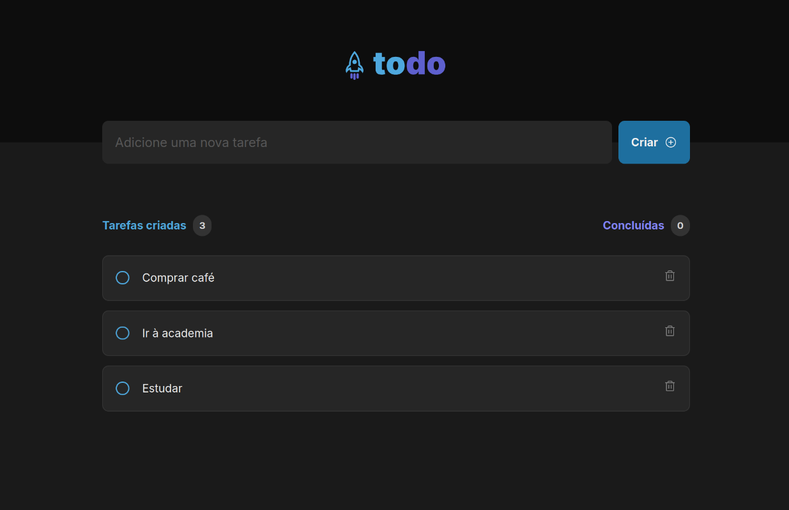

# Desafio To-Do em ReactJS (Rocketseat)

Este é um todo app simples construído com ReactJS. O aplicativo permite que os usuários adicionem, excluam e marquem tarefas como concluídas.

## Funcionalidades

- Adicionar uma nova tarefa
- Marcar uma tarefa como concluída
- Excluir uma tarefa
- Mostrar o progresso de conclusão das tarefas

## Demonstração

## Tecnologias Utilizadas

- ReactJS
- CSS
